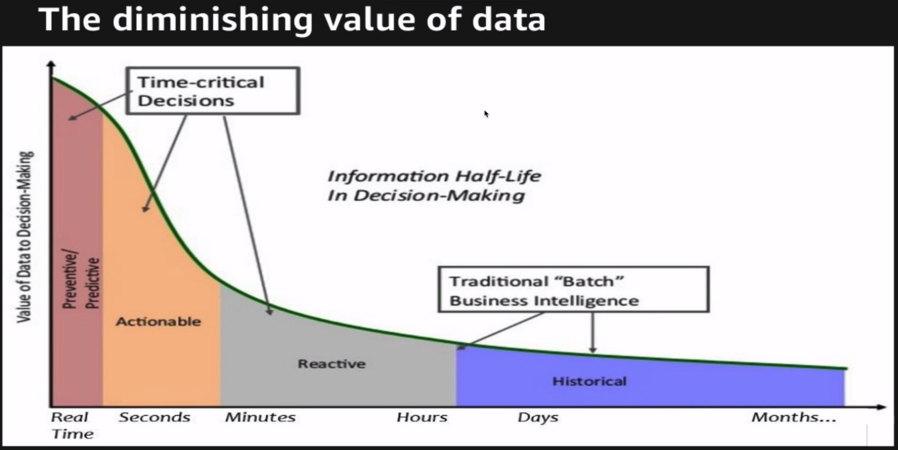

# Why this course is so important
- users are placing high value in products that provide real-time experiences that adapt to each users actions, their personas and their journey along a digital product
- aws kinesis brings advances real-time computation nearest the source of origin where events in the world are captured and of most value
- data has a time value components

