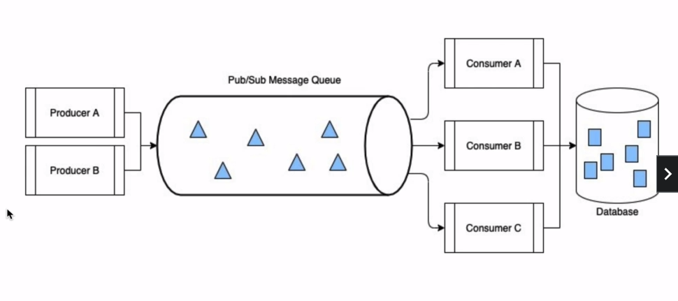

# Kinesis Data Streams

## Foundation of Real-Time Streaming using Kinesis Service Offering

- massively scalable, durable pub/sub style messaging system used for streaming real-time data events

---

### What is Pub/Sub Messaging 

Publish and Subscribe messaging systems enable event-driven architectures which decouple system components to increase reliability, scalability and general performance.

### Examples of Pub/Sub Messaging
- Pub/Sub messaging decouples applications that ingest data into systems from that consume data
- Provides fault tolerance for if a component downstream from messaging queue fails or is brought down for updates (scaling/bug fixes)
- Producers and consumers provide decoupled architecture but must agree on a standard data format

---

- events | data records | messages <--- synonymous 