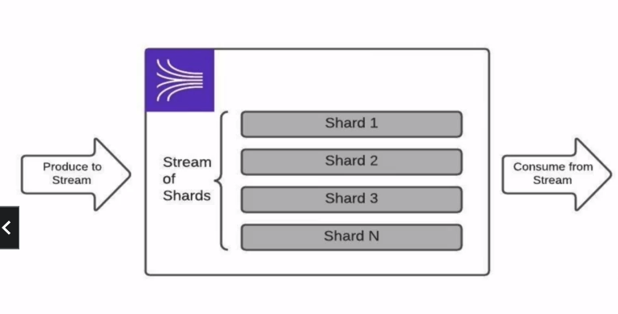
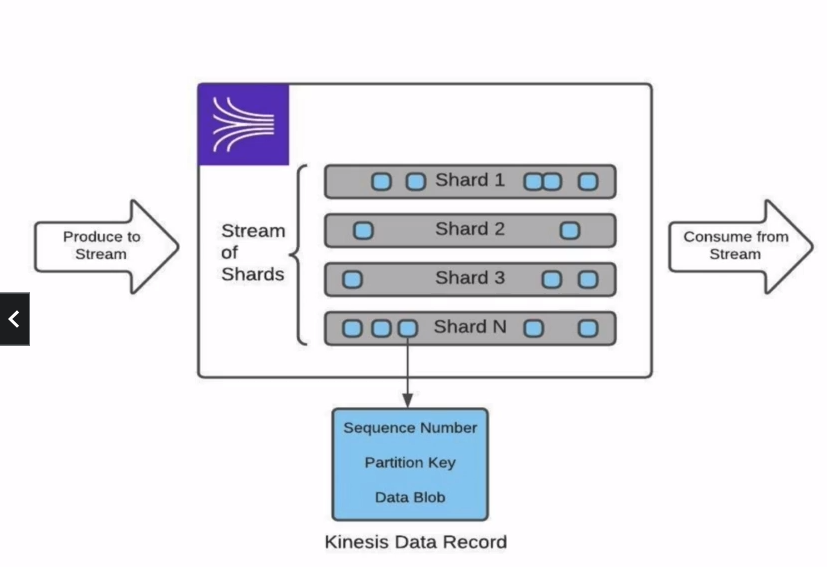

# Kinesis Data Streams: Streams of Shards

- A stream is a logical abstraction for grouping messages of identical / similar data structure
- producers write data in a consistent format to a stream to be used by one or more downstream systems
- consumers read data from a stream to be used for meaningful computations
- streams are composed of scalable units of parallelism called shard enabling consumption by consumers
- data retention of 24h up to 1 year

---

## Kinesis Data Streams: Messages as Data Records

- A data record in Kinesis is composed of a sequence number, a partition key and binary serialized data blob
- the partition key is used to group records in the same shard and allow for consumption in the order they were written based on sequence number

- Hot Shard - when shard is taking disproportionally a lot of data compare to other shards