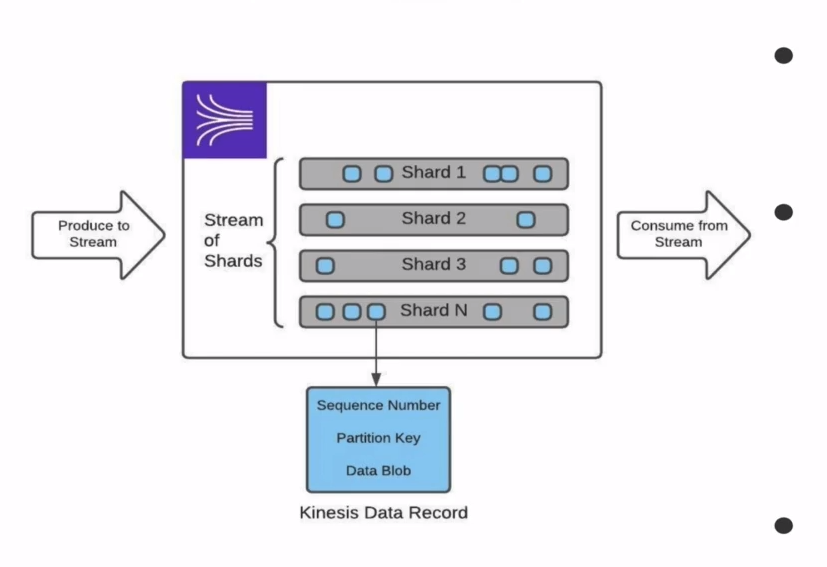

# Kinesis Data Streams: Shard I/O Limits

- Shard can handle writes up to 1 MB per second
  - up to 1.000 records written per second
  - max individual payload of 1 MB base64 encoded
- Shard can handle reads up to 2 MB per second
  - up to 10 000 record read per second
  - max of 5 reads per second
  - max individual read payload of 10 MB but, then must remain inactive for 5 second or exception is thrown (10 MB / 2 MB per second = 5 seconds)
- Shards can be added and removed to scale Kinesis

---

## Kinesis Data Streams: Shard I/O (Enhance Fanout Consumers)

- Enhanced Fanout Consumers use a model of consumption where data is pushed to Consumers allowing for greater consumption limit
  - read up to 2 MB per second per Consumer per shard
  
- subscriber subscribe to the kinesis and kinesis will inform it when it has some new data