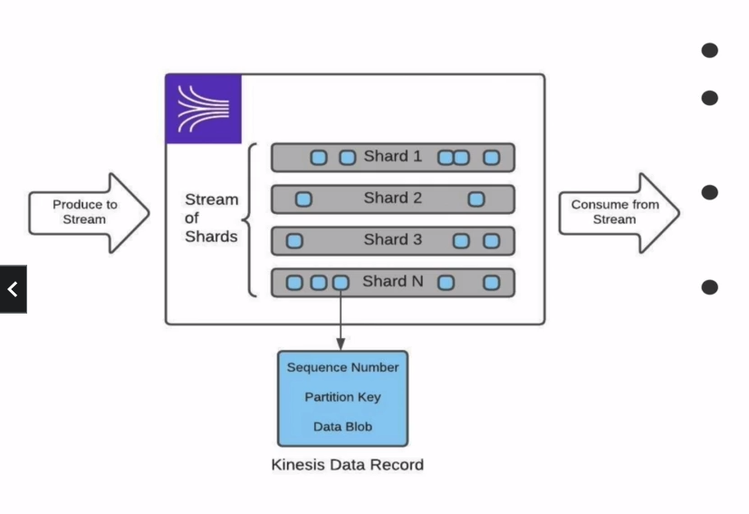

# Kinesis Data Streams: Cost Model
- Charged per shard hour
- charged per data write in units of 25KB with write smaller than 25KB being counted as 1 unit
- charged for extended data storage greater than 24 hours
- extra cost to use Enhanced Fanout Consumer on both data retrieval and shard hour

