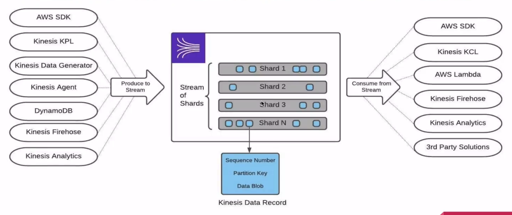

# Overview of Producers and Consumers

## Produce to the stream
`Kinesis KPL` - An Amazon Kinesis Data Streams producer is an application that puts user data records into a Kinesis data stream (also called data ingestion). The Kinesis Producer Library (KPL) simplifies producer application development, allowing developers to achieve high write throughput to a Kinesis data stream.
https://docs.aws.amazon.com/streams/latest/dev/developing-producers-with-kpl.html

`Kinesis Data Generator` - https://aws.amazon.com/blogs/big-data/test-your-streaming-data-solution-with-the-new-amazon-kinesis-data-generator/

`kinesis agent` - Kinesis Agent is a stand-alone Java software application that offers an easy way to collect and send data to Kinesis Data Streams. The agent continuously monitors a set of files and sends new data to your stream. The agent handles file rotation, checkpointing, and retry upon failures. It delivers all of your data in a reliable, timely, and simple manner. It also emits Amazon CloudWatch metrics to help you better monitor and troubleshoot the streaming process.
https://docs.aws.amazon.com/streams/latest/dev/writing-with-agents.html

`dynamoDB` - you can watch and subscribe changes in the dynamodb and this changes can be emitted to kinesis data stream

`kinesis firehose` - configure to transfer or copy data from into the kinesis data stream

`kinesis analytics` - can stream analytics to stream

## Consume from Stream

`Kinesis KCL` - One of the methods of developing custom consumer applications that can process data from KDS data streams is to use the Kinesis Client Library (KCL).

