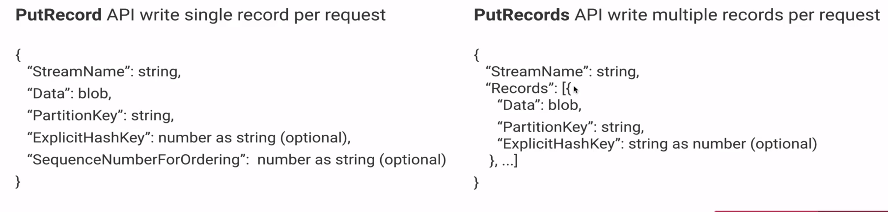

# Producing Records to KDS with PutRecord and PutRecords

### Kinesis Data Streams: Producer Flow

All producers use the PutRecord and PutRecords APIs

- `ExplicitHashKey` - you can overwrite it
- `SequenceNumberForOrdering` - keeping order in what messages came to kinesis - we can keep order even if it is async operation 

- `PutRecords` - is batch method, it is advice to use this mehtod
- `Record` - you have array of records
  - there is no way to specify the sequence order
  - reason: because kinesis receive this 10 record at the same time so there is natural order of the supplied array
  - ordered by 'partition key'