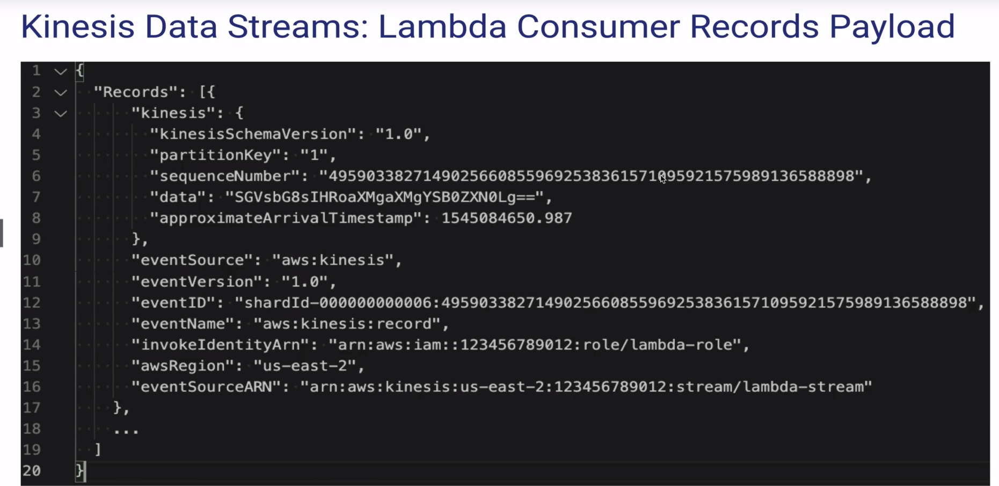
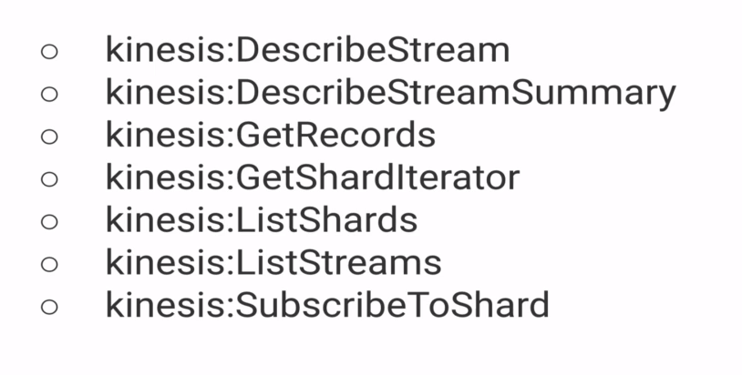

# Kinesis Data Streams: Serverless Lambda Consumers
- Lambda service collects records and passes them to a function you write and deploy to Lambda
  - Configurable batching to control amount of records passed to function code
- Standard pull based consumer or `Enhance Fan-Out (EFO)` push based consumer
  - Standard pull consumers share read capacity (2MB/sec, 5req/sec)
  - Enhanced Fan-Out consumers do not share capacity (2MB/sec each lambda)
- Serverless is Amazing
  - no infrastructure
  - no patching/updates
  - Scales automatically (configure to handle multi-shard consumption in parallel)
  - good tooling for Rapid Application Development (AWS SAM)

---

---

# Kinesis Data Streams: Lambda Consumer Permissions

IAM Role with Specific Permissions is needed by Lambda to consume Kinesis 

AWSLambdaKinesisExecutionRole is an AWS managed policy role which has all these permissions

---

# Kinesis Data Streams: Lambda Consumer configurations:
- Stream: the KDS Stream ARN
- Batch Size: default is 1, goes up to 10 000 records (6 MB payload size limit)
- Batch Window: seconds to wait for records to accumulate before invoke
- Starting position
  - latest: only consume new records as they are added to KDS
  - Trim Horizon: process from the beginning (oldest records)
  - at timestamp: start at a specific time (batch windowing)
- Retry Attempts: number of times to retry failed batch of records
- max age of records: specify the oldest record you allow Lambda to process
- split batch on Error: whether to split a batch when errors are encountered
- concurrent batches per Shard: number of shard to be processed in parallel

---

