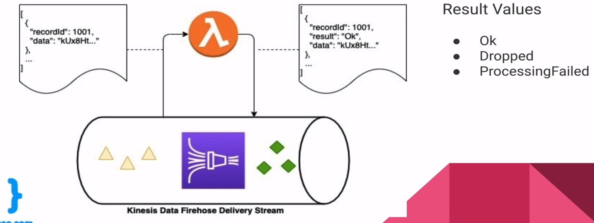

# Kinesis Data Firehose: AWS Lambda Transformation

- Records buffered into batches up to 6 MB before sent to Lambda
- Each Lambda is executed synchronously for maximum of 5 minutes
- multiple lambdas can execute in parallel
- of course it is not mandatory - it is just option

---

---

